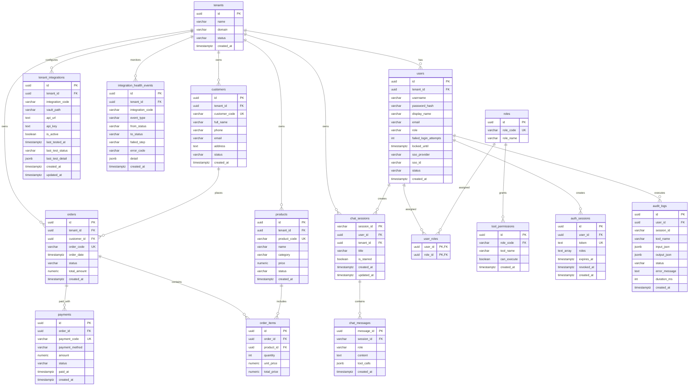

# Trợ lý AI Doanh nghiệp (Enterprise AI Assistant - EAA)

Nền tảng Trợ lý AI doanh nghiệp thông minh bằng tiếng Việt, xây dựng trên kiến trúc **MCP (Model Context Protocol)**. Mô hình ngôn ngữ lớn (LLM) và AI Orchestrator **không bao giờ** truy cập trực tiếp vào cơ sở dữ liệu hay các hệ thống nghiệp vụ (CRM, ERP, Helpdesk, Automation...). Mọi thao tác dữ liệu đều phải đi qua **MCP Gateway** dưới dạng các *tool* (công cụ) được kiểm soát phân quyền chặt chẽ (RBAC), rate-limit, chống rò rỉ dữ liệu (Masking) và ghi Audit Log đầy đủ.


---

## Kiến trúc tổng quan

```text
User (Chat UI :3000)
   │ Bearer token
   ▼
AI Orchestrator (:8082) ──(mock / openai / local-LLM)
   │ HTTP (REST / Tools Calling Loop)
   ▼
MCP Gateway (:8085 / :8081) ──(RBAC + Masking + Rate-limit + Audit Log)
   │
   ├─▶ mcp-server-postgres  (Đọc dữ liệu nghiệp vụ: Khách hàng, Đơn hàng, Doanh thu)
   ├─▶ mcp-server-crm       (Kết nối Frappe CRM: Khách hàng, Cơ hội bán hàng)
   ├─▶ mcp-server-erpnext   (Kết nối ERPNext: Hóa đơn, Doanh số, Tồn kho)
   ├─▶ mcp-server-zammad    (Kết nối Zammad Helpdesk: Quản lý Ticket hỗ trợ)
   ├─▶ mcp-server-gitea     (Kết nối Gitea Git Server: Quản lý Repositories, Code)
   ├─▶ mcp-server-n8n       (Kết nối n8n Automation: Bắn Webhook, Gửi tin nhắn Telegram)
   └─▶ mcp-server-rag       (Tìm kiếm tài liệu & chính sách nội bộ doanh nghiệp)

PostgreSQL (:55432)  ◀── Users, Sessions, Chat History, Tenants, Audit Logs
HashiCorp Vault (:8200) ◀── Lưu trữ bí mật (API Key, URL, Tokens) cho từng Tenant
n8n Automation (:5678) ◀── Workflow Engine tự động hóa (Telegram, Email, Webhook)
```

### Nguyên tắc thiết kế cốt lõi:
1. **Zero Direct DB Access**: LLM không kết nối database trực tiếp và không tự sinh câu lệnh SQL tùy tiện.
2. **Chặt chẽ theo danh mục Tool**: Gateway chỉ expose các tool nghiệp vụ đã khai báo trong `tools-config.json`.
3. **Phân quyền & Kiểm soát (RBAC)**: Mọi lượt gọi tool đều được xác thực quyền qua `tool_permissions` và ghi nhận vào `audit_logs`.
4. **Bảo mật bí mật (Vault Integration)**: API Key, Access Token của đối tác thứ ba được bảo vệ trong HashiCorp Vault, không lưu trữ dạng plaintext trong Database.

---

## Sơ đồ Cơ sở Dữ liệu (ERD - Entity Relationship Diagram)

Hệ thống cơ sở dữ liệu PostgreSQL (`localhost:55432 / enterprise_ai_demo`) gồm **16 bảng thực thể** được phân bổ theo 3 phân hệ nghiệp vụ:

- **1. Multi-Tenancy & Phân quyền (IAM / RBAC)**: `tenants`, `users`, `roles`, `user_roles`, `tool_permissions`, `auth_sessions`, `audit_logs`, `tenant_integrations`, `integration_health_events`.
- **2. Ngữ cảnh Trò chuyện & AI (Chat & Context)**: `chat_sessions`, `chat_messages`.
- **3. Nghiệp vụ Doanh nghiệp (Business Core / ERP)**: `customers`, `products`, `orders`, `order_items`, `payments`.



> **Xem thêm**: Tài liệu đặc tả ERD tại [`docs/erd.md`](docs/erd.md) hoặc xem giao diện HTML trực quan tương tác tại [`docs/erd.html`](docs/erd.html).

---

## Yêu cầu hệ thống

1. **Node.js 20+**
2. **Docker & Docker Compose** (đang chạy)
3. **npm**

---

## Khởi chạy hệ thống

### Cách 1: Docker Compose (Khuyến nghị cho toàn bộ hệ sinh thái)

`docker-compose.yml` khởi chạy toàn bộ các dịch vụ: `postgres`, `mcp-gateway`, `ai-orchestrator`, `chat-ui`, `vault`, `gitea`, `n8n` cùng các service ERPNext/Zammad liên quan.

```bash
# Khởi động toàn bộ container
docker compose up -d

# Kiểm tra trạng thái các container
docker compose ps
```

### Danh sách Cổng & Dịch vụ mặc định:

| Dịch vụ | URL Local | Cổng Container | Mô tả |
|---|---|---|---|
| **Chat UI** | http://localhost:3000 | `3000` | Giao diện trò chuyện & Quản trị hệ thống |
| **MCP Gateway** | http://localhost:8085 (hoặc `8081`) | `8081` | Cổng bảo mật, định tuyến Tool & Quản trị tích hợp |
| **AI Orchestrator** | http://localhost:8082 | `8082` | Bộ não AI Agentic, điều phối hội thoại & Tool Calling |
| **PostgreSQL Core** | `localhost:55432` | `5432` | Cơ sở dữ liệu chính của EAA (Users, Sessions, Audit) |
| **HashiCorp Vault** | http://localhost:8200 | `8200` | Quản lý Secret & API Key (Token dev: `root`) |
| **n8n Automation** | http://localhost:5678 | `5678` | Nền tảng tự động hóa quy trình (Workflow Engine) |
| **Gitea Server** | http://localhost:3001 | `3000` | Git Server nội bộ cho mã nguồn & tài liệu |
| **ERPNext** | http://localhost:8090 | `8080` | Hệ thống quản trị doanh nghiệp (ERP) |
| **Zammad Helpdesk** | http://localhost:8080 | `8080` | Hệ thống quản lý vé hỗ trợ khách hàng (Ticketing) |

---

### Cách 2: Chạy cục bộ từng dịch vụ (Dành cho Development & Debug)

```bash
# 1) Khởi chạy Database, Vault và n8n nền tảng
docker compose up -d postgres vault enterprise_ai_n8n

# 2) Khởi động MCP Gateway
cd apps/mcp-gateway
cp .env.example .env
npm install
npm run dev                # Chạy tại http://localhost:8085 (hoặc 8081)

# 3) Khởi động AI Orchestrator
cd apps/ai-orchestrator
cp .env.example .env
npm install
npm run dev                # Chạy tại http://localhost:8082

# 4) Khởi động Chat UI
cd apps/chat-ui
npm install
npm run dev                # Chạy tại http://localhost:3000
```

---

## Xác thực & Phân quyền (Authentication & RBAC)

Toàn bộ API (ngoại trừ `/health` và `/login`, `/auth/*`) yêu cầu xác thực qua HTTP Header:

```http
Authorization: Bearer <token>
```

### 1. Phương thức đăng nhập hỗ trợ:
- **Username / Password**: `POST /api/login`
- **Khách vãng lai (Guest Mode)**: `POST /api/auth/guest` (Cấp quyền `viewer`)
- **Google Single Sign-On (SSO)**: `POST /api/auth/google` (Yêu cầu `GOOGLE_CLIENT_ID`)

### 2. Tài khoản thử nghiệm mặc định (Mật khẩu: `<username>123`):

| Username | Password | Vai trò (Role) | Phạm vi quyền hạn |
|---|---|---|---|
| `admin` | `admin123` | **admin** | Toàn quyền quản trị hệ thống, cài đặt tích hợp, audit log |
| `manager` | `manager123` | **manager** | Xem báo cáo doanh thu, đơn hàng, khách hàng, trigger workflow |
| `staff` | `staff123` | **staff** | Tra cứu thông tin khách hàng, đơn hàng, ticket hỗ trợ |
| `viewer` | `viewer123` | **viewer** | Chế độ chỉ đọc cơ bản, bị giới hạn truy cập số liệu nhạy cảm |

---

## Danh mục API chính

### MCP Gateway (`:8085` / `:8081`)

| Method | Endpoint | Mô tả | Phân quyền |
|---|---|---|---|
| POST | `/api/login` | Đăng nhập tài khoản | Public |
| POST | `/api/auth/google` | Đăng nhập Google SSO | Public |
| GET  | `/api/me` | Lấy thông tin tài khoản hiện tại | Authenticated |
| GET  | `/api/tools` | Lấy danh sách tools được phép gọi theo vai trò | Authenticated |
| POST | `/api/tools/call` | Thực thi 1 Tool nghiệp vụ | Authenticated + RBAC |
| GET  | `/api/audit-logs` | Truy vấn nhật ký kiểm toán hệ thống | Admin |
| GET  | `/api/admin/integrations` | Danh sách cấu hình tích hợp (CRM, ERP, n8n...) | Admin |
| POST | `/api/admin/integrations` | Cập nhật cấu hình tích hợp (Ghi vào Vault & DB) | Admin |
| POST | `/api/admin/integrations/:code/test` | Kiểm tra kết nối đa tầng (Layered Probe) cho dịch vụ đã lưu | Admin |
| POST | `/api/admin/integrations/test` | Kiểm tra kết nối bản nháp trước khi lưu (Draft Test) | Admin |
| GET  | `/api/admin/system/health` | Lấy thông tin tổng quan sức khỏe toàn hệ thống | Admin |

### AI Orchestrator (`:8082`)

| Method | Endpoint | Mô tả |
|---|---|---|
| POST | `/api/chat` | Gửi câu hỏi, AI tự động lập kế hoạch gọi Tool và trả lời |
| POST | `/api/chat/edit` | Chỉnh sửa một câu hỏi đã gửi và tạo câu trả lời mới |
| GET  | `/api/chat/sessions` | Lấy danh sách các phiên trò chuyện của người dùng |
| GET  | `/api/chat/sessions/:sessionId` | Lấy chi tiết toàn bộ tin nhắn trong một phiên |
| PATCH| `/api/chat/sessions/:sessionId` | Đổi tên phiên trò chuyện hoặc Đánh dấu sao (Star) |
| DELETE| `/api/chat/sessions/:sessionId`| Xóa một phiên trò chuyện |
| GET  | `/api/chat/search?q=...` | Tìm kiếm toàn văn trong lịch sử hội thoại |

---

## Cơ chế Kiểm tra Kết nối Đa Tầng (Layered Probe Testing)

Khi Quản trị viên bấm **"Kiểm tra kết nối"** trên giao diện Cài đặt Tích hợp, hệ thống thực hiện quy trình kiểm tra chuyên sâu 8 tầng:

```text
[1. Vault Secret] ──▶ [2. Config Spec] ──▶ [3. MCP Subprocess] ──▶ [4. DNS Resolution]
                                                                         │
[8. Business Ready] ◀── [7. HTTP Probe] ◀── [6. TLS Handshake] ◀── [5. TCP Socket]
```

- **Vault & Config Check**: Đảm bảo URL và API Key được mã hóa và nạp chính xác từ HashiCorp Vault.
- **MCP Server Process**: Xác nhận tiến trình connector nền tảng đang sẵn sàng.
- **DNS & TCP Handshake**: Phân giải tên miền và bắt tay Socket TCP với máy chủ đích.
- **SSL/TLS & HTTP Read-Only Probe**: Gửi request kiểm tra không phá hủy dữ liệu (Read-only Auth probe) để xác minh độ hợp lệ của Token/Key.
- **Chống SSRF (Server-Side Request Forgery)**: Tự động chặn các yêu cầu trỏ vào dải IP nội bộ nguy hiểm (AWS/GCP metadata, loopback cấm). Hỗ trợ whitelist các service Docker nội bộ qua biến môi trường `INTEGRATION_TEST_ALLOWED_PRIVATE_HOSTS` (`frontend`, `gitea`, `n8n`, `zammad`...).

---

## Danh mục MCP Server con (`packages/`)

| Package | Vai trò & Danh mục Tools |
|---|---|
| `packages/mcp-server-postgres` | Tra cứu dữ liệu kinh doanh cốt lõi: `search_customer`, `get_customer_orders`, `get_order_detail`, `get_revenue_summary`, `get_top_customers`, `get_product_sales_summary`. |
| `packages/mcp-server-crm` | Kết nối Frappe CRM: `crm_get_customer_status`, `crm_get_opportunities`. |
| `packages/mcp-server-erpnext` | Kết nối ERPNext: `get_inventory_status` (tồn kho), `get_sales_invoices` (hóa đơn bán), `get_purchase_invoices` (hóa đơn mua), `search_customer`, `get_customer_orders`, `get_revenue_summary`. |
| `packages/mcp-server-zammad` | Kết nối Zammad Helpdesk: `get_open_tickets` (Tra cứu các ticket đang mở/chờ xử lý). |
| `packages/mcp-server-gitea` | Kết nối Gitea: `search_repositories` (Tìm kiếm repository, mã nguồn nội bộ). |
| `packages/mcp-server-n8n` | Kết nối n8n: `trigger_n8n_webhook` (Kích hoạt workflow tự động gửi Telegram, Email, Webhook). |
| `packages/mcp-server-rag` | `search_internal_documents` (Tìm kiếm văn bản, tài liệu, quy định nội bộ). |

---

## Cấu hình LLM Provider

Biến `LLM_PROVIDER` trong `apps/ai-orchestrator/.env` hỗ trợ 3 chế độ:

```env
# 1. Mock Mode (Mặc định cho dev offline, không cần API Key, rule-based planner)
LLM_PROVIDER=mock

# 2. OpenAI / Gemini (Endpoint tương thích OpenAI)
LLM_PROVIDER=openai
OPENAI_API_KEY=your_api_key_here
OPENAI_MODEL=gpt-4o-mini
# OPENAI_BASE_URL=https://generativelanguage.googleapis.com/v1beta/openai/  (nếu dùng Gemini)

# 3. Local LLM (Ollama / vLLM / LM Studio)
LLM_PROVIDER=local
LOCAL_LLM_BASE_URL=http://localhost:11434/v1
```

---

## Kiểm thử (Testing)

Hệ thống đi kèm bộ kiểm thử tự động toàn diện hơn **316+ automated tests** bao phủ toàn bộ các tầng:

```bash
# Kiểm thử MCP Gateway (159 unit & integration tests - 20 test suites)
cd apps/mcp-gateway && npm test

# Kiểm thử AI Orchestrator (15 unit & integration tests - 6 test suites)
cd apps/ai-orchestrator && npm test

# Kiểm thử Chat UI (142 unit & integration tests - 12 test suites)
cd apps/chat-ui && npm test

# Kiểm thử E2E giao diện bằng Playwright (Đầy đủ luồng đăng nhập, chat, gọi tool)
cd apps/chat-ui && npm run test:e2e
```

---

## Hướng dẫn triển khai Production

Sử dụng cấu hình production tối ưu hóa `docker-compose.prod.yml`:

```bash
cp .env.production.example .env
./deploy.sh          # Trên Linux/macOS
# hoặc
./deploy.ps1         # Trên Windows PowerShell
```

Chi tiết các bước thiết lập chứng chỉ SSL/TLS, Caddy Reverse Proxy và sao lưu tự động có trong tài liệu [`docs/DEPLOYMENT_GUIDE.md`](docs/DEPLOYMENT_GUIDE.md).

---

## Tài liệu kỹ thuật chi tiết (`docs/`)

- [**Sơ đồ Cơ sở Dữ liệu (ERD - Markdown)**](docs/erd.md) & [**ERD Trực quan (HTML)**](docs/erd.html): Chi tiết 16 bảng dữ liệu, quan hệ khóa ngoại (FK), kiểu dữ liệu và ràng buộc toàn vẹn.
- [**Kiến trúc Hệ thống (Architecture)**](docs/architecture.md): Luồng xử lý chi tiết từ Chat UI -> AI Orchestrator -> MCP Gateway -> MCP Connectors.
- [**Danh mục Công cụ & Tham số (Tools Guide)**](docs/tools.md): Chi tiết toàn bộ 15+ tool nghiệp vụ, JSON schema đầu vào/đầu ra và mapping server.
- [**Đặc tả API (API Reference)**](docs/api.md): Đặc tả toàn bộ REST API của MCP Gateway và AI Orchestrator.
- [**Hướng dẫn Dự án (Project Guide)**](docs/project-guide.md): Cẩm nang tổng thể về kiến trúc, luồng phân quyền và quy trình phát triển.
- [**Hướng dẫn Triển khai Production (Deployment Guide)**](docs/DEPLOYMENT_GUIDE.md): Hướng dẫn thiết lập môi trường Production với SSL/TLS, Caddy và Backup tự động.
