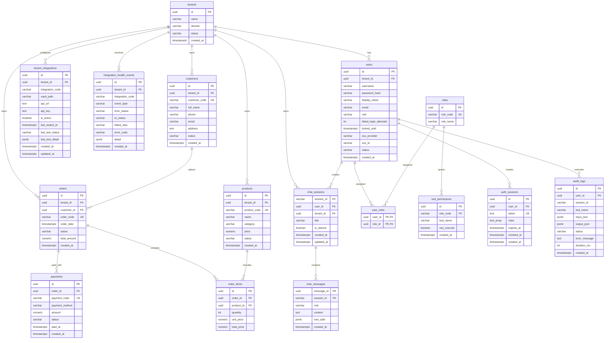

# Sơ Đồ Thực Thể - Liên Kết (ERD) - Enterprise AI Assistant

Tài liệu này lưu trữ sơ đồ ERD chuẩn của hệ thống cơ sở dữ liệu PostgreSQL (gồm 16 bảng thực thể). Bạn có thể xem trực tiếp trên GitHub, VS Code (với Markdown Preview Mermaid Support) hoặc copy mã nguồn bên dưới vào [Mermaid Live Editor](https://mermaid.live).

